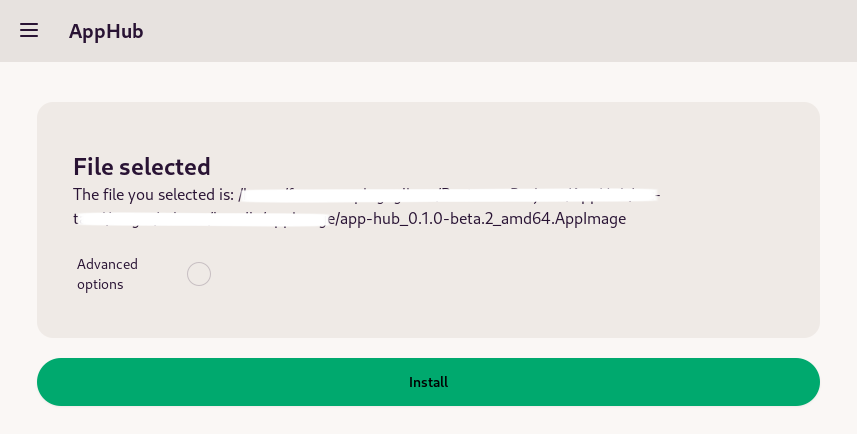

<p align="center">
  
</p>

# 🚀 AppHub

AppHub is a Linux desktop application that simplifies the installation and management of .appImage packages through an intuitive graphical interface. Additionally, it provides the ability to easily uninstall applications installed via AppImage.

## 📸 Screenshots
<p align="center">
  
</p>

More screenshots available in the [screenshots](screenshots) folder.

## 💻 System Requirements
- **Operating System:** Linux*

Note*: The application is currently tested only on Ubuntu and PopOs workstation. 
However, it should work on any Linux distribution that supports the AppImage format.
Distribution-specific packages will be provided in the future.

## 💿 Installation Modes
The project supports three installation modes:
1. **.deb**: Download the .deb package from the GitHub repository and install it using your system's package manager.

### Installation from Source

#### Steps

To install the application from source, follow these steps:

```bash
# Clone the repository
git clone https://github.com/francesco-gaglione/AppHub.git

# Change directory to the project folder
cd AppHub

# Install
just install
```

## 🌟 Key Features
- Simplified installation of .appImage packages.
- Management of applications installed via AppImage.
- Intuitive graphical interface for easy navigation.

## 📖 Usage
Currently, the usage of the application is not documented. However, detailed guides will be provided once the project is more stable and structured.

## 📝 License
The project is currently released under the MIT license. Please refer to the [LICENSE](LICENSE) file for more information.

Note: The license may change in the future due to the use of third-party libraries and frameworks.

## 🤝 Contributing
AppHub is a project developed in spare time, and contributions are welcome! However, there are currently no specific contribution guidelines. They will be defined once the project is more stable and structured.

In the meantime, feel free to fork the project and submit pull requests. We will review them and provide feedback.

Or, if you have any suggestions or feedback, please open an issue, and we will address it as soon as possible.

## ⚠️ Project Status
The project is currently in its initial development phase. There are still many bugs to be fixed and many features to be implemented. Please be patient as we work to improve and refine the application.

## ⚠️ Experimental
The project is in experimental mode and is not yet ready for production use. 
Please use it at your own risk.

## 🚀 Roadmap

Take a look to the roadmap in the [ROADMAP](roadmap.md).
